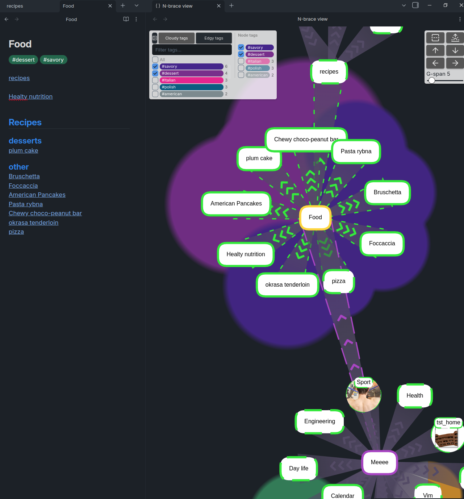

# Obsidian N-brace Plugin

[Obsidian N-brace Plugin](https://nn-ninja.github.io/n-brace/) Homepage

A more intuitive Graph navigation and visualization for Obsidian.

See the demo: <not yet published!>

Donate if you appreciate my work!
https://buymeacoffee.com/nbrace

## Installation

### Through community plugin store

Not yet available. Easiest option of installation is through BRAT plugin (below).

### Using BRAT

1. Install the Brat Plugin in Settings → Community plugins → Browse BRAT → push the Install button
2. Enable BRAT in Settings → Community plugins
3. Open BRAT settings and click "Add Beta plugin"
4. Enter the repository URL: `nn-ninja/n-brace`
5. Click "Add Plugin" and enable N-brace in your community plugins

BRAT will automatically check for updates and notify you when new versions are available.

### Manual installation

1. cd to `.obsidian/plugins`
2. git clone this repo
3. `cd obsidian-n-brace && bun install && bun run build`
4. there you go 🎉

## Usage

In a note tab context menu (right click), click on `use N-brace` to open a local graph of viewed note.

The graph appears in the right-hand view and is designed to be used alongside the note on the left. Its purpose is to help you quickly understand how the current note connects to others and to visualize its overall structure.

G-span defines how large a portion of the graph is displayed. When the number of visible nodes reaches this limit, the view automatically shrinks by hiding the most distant nodes.

### Navigation

You can navigate using the keyboard arrow keys. Notes that haven’t been expanded yet in the local graph are shown with a dotted border.

If you need to explore the parent notes, hold Ctrl to reverse the navigation direction — the link directions will swap accordingly. 

## Notes

At present, the n-brace graph model is initialized during application startup, which may result in longer loading times.

I have in my plans to optimize this process.

## Features

### Local Graph

It is designed to rather operate on a local graph, not on huge and unclear global graph. 

### Save Setting

You can update and save your general settings.

## Acknowledgement

I want to especially thank to the creators of this repos:
1. Force Graph repo: <https://github.com/vasturiano/force-graph>
2. The original 3D graph plugin: <https://github.com/AlexW00/obsidian-3d-graph>
3. The improved version: <https://github.com/HananoshikaYomaru/obsidian-3d-graph>

Their work was very helpful in getting my project off the ground.

